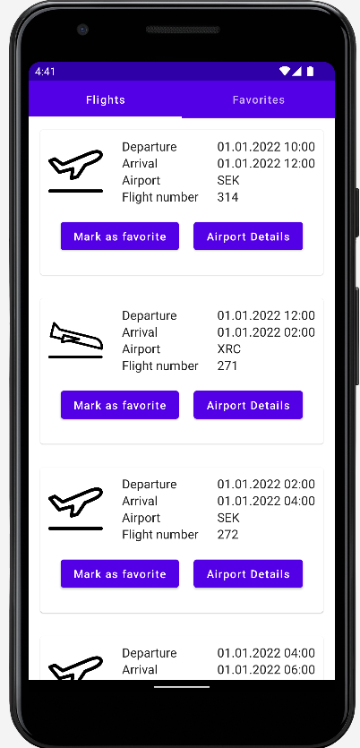
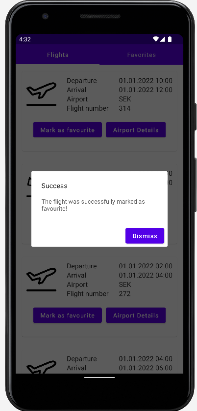
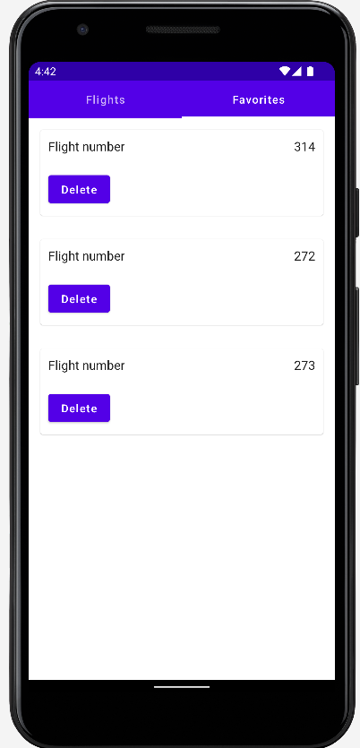

# Microprojekt Airplane Flights

## Features

* Ability to view available flights
* Flights can be added to the favorite list
* Flights can be removed from the favorite list

### Backend

* Native compiled using graalvm
* Deployed on [leocloud](https://student.cloud.htl-leonding.ac.at/d.pavelescu/airport-backend)
* Github action to build, test and deploy latest changes (pushed on main branch) to leocloud
* End2End tests using restassured

### Frontend (Jetpack Compose)

* Retrofit used for REST
* RoomDB used to persist favorite flights

## Screenshots

     
     
     

